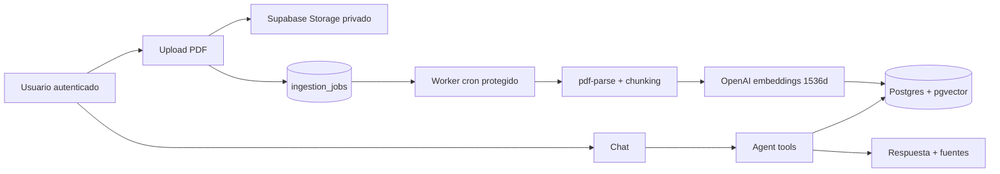

# StudyAgent

StudyAgent convierte PDFs privados en un asistente de estudio con búsqueda
grounded, tools para practicar y conversaciones persistentes. Es un proyecto de
applied AI diseñado para hacer visibles sus decisiones técnicas, no para
presentar un chatbot genérico como un producto terminado.

## Qué hace hoy

- Sube PDFs a un bucket privado por usuario y los procesa mediante una cola
  durable respaldada por Postgres.
- Extrae texto con `pdf-parse`, conserva el número de página cuando el
  extractor lo aporta, crea chunks de ~700 tokens con solape de 100 y genera
  embeddings de 1536 dimensiones.
- Recupera contexto mediante pgvector/HNSW; ofrece hybrid search BM25 + RRF y
  reranking como flags evaluables, no como defaults sin medir.
- Usa tools con schemas Zod para buscar, resumir, explicar y generar quizzes o
  flashcards; las herramientas devuelven fuentes enlazables al documento.
- Aísla documentos, chunks y conversaciones mediante Supabase Auth, RLS,
  Storage privado y un filtro de documentos permitido dentro de cada tool.
- Registra trazas sin contenido sensible y permite feedback útil/no útil sobre
  respuestas persistidas para revisar calidad en `/admin`.



## Stack

- Next.js 16 App Router, React 19 y TypeScript estricto
- Supabase Auth, Postgres, Storage y pgvector
- Vercel AI SDK v4, OpenAI `gpt-4o-mini` y `text-embedding-3-small`
- `pdf-parse`, Zod, Vitest y Playwright

## Inicio local

Requiere Node 20+, Docker y Supabase CLI.

macOS/Linux:

```bash
npm install
cp .env.example .env.local
supabase start
supabase db reset
npm run db:types
npm run dev
```

PowerShell:

```powershell
npm install
Copy-Item .env.example .env.local
supabase start
supabase db reset
npm run db:types
npm run dev
```

Completa `.env.local` con Supabase, OpenAI, `ADMIN_EMAILS` y un `CRON_SECRET`
largo. `CHAT_REQUESTS_PER_MINUTE` limita el chat; las tarifas de tokens son
opcionales y solo alimentan la estimación de coste en `/admin`.

## Ingesta durable

El upload crea un documento `pending`, guarda el archivo y encola un job. El
worker `GET /api/internal/ingest` reclama un job de forma atómica, reintenta
fallos transitorios hasta tres veces y deja un estado terminal visible al
usuario. En Vercel, `vercel.json` lo programa cada cinco minutos y el endpoint
exige `Authorization: Bearer $CRON_SECRET`.

Para desarrollo, invoca el worker manualmente tras subir un PDF:

```powershell
Invoke-WebRequest http://localhost:3000/api/internal/ingest `
  -Headers @{ Authorization = "Bearer $env:CRON_SECRET" }
```

## Calidad RAG y límites conocidos

El harness en `evals/` mide recall@k, MRR, hit rate, faithfulness, relevancia y
latencia. No se incluyen documentos privados ni IDs ficticios en Git: antes de
afirmar una mejora de hybrid search o reranking, añade un dataset etiquetado a
tu instancia y publica el delta del runner.

```bash
npm run eval
npm run eval:compare
```

Limitaciones actuales: no hay OCR para PDFs escaneados, las citas enlazan a la
lista de documentos (no a un visor PDF con resaltado), y la cuota de chat es
un fixed window sencillo, no un control de facturación empresarial.

## Verificación

```bash
npm run lint
npm run typecheck
npm run test
npm run build
```

`npm run test:e2e` requiere credenciales reales y servicios configurados. El
workflow de CI ejecuta lint, typecheck, tests y build en cada push o PR a
`main`.

## Demo de dos minutos

1. Entra con el usuario demo y muestra un PDF ya `ready`.
2. Pregunta un hecho concreto y abre `search_documents` para enseñar fuentes.
3. Genera un quiz y flashcards; ambas salidas son estructuradas.
4. Abre una fuente y recarga el chat para mostrar procedencia y persistencia.
5. Explica que hybrid/reranking se activan solo tras medirlos contra el
   harness, y que las trazas no almacenan texto de PDFs ni respuestas.

## Despliegue

1. Aplica las migraciones en Supabase y verifica el bucket privado `documents`.
2. Configura las variables de `.env.example` en Vercel, incluido `CRON_SECRET`.
3. Despliega `main`; Vercel ejecutará el worker definido en `vercel.json`.
4. Comprueba `/login`, `/documents`, `/chat`, la ejecución cron y `/admin`.

## Documentación

- `ARCHITECTURE.md`: contratos de tablas, rutas, tools y configuración.
- `evals/README.md`: formato del dataset y cómo interpretar los resultados.
- `ROADMAP.md`: mejoras de RAG y producto todavía pendientes.
- `docs/gcp-mapping.md`: ruta de despliegue GCP sin afirmar una migración no realizada.
- `AGENTS.md`: reglas de implementación y seguridad.
