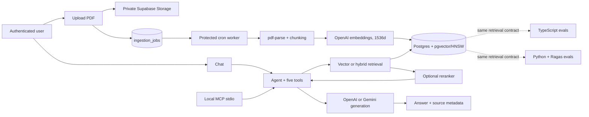

# StudyAgent

[](https://github.com/hectorjimenezpalomo/StudyAgent/actions/workflows/ci.yml)
[](LICENSE)
[](https://github.com/hectorjimenezpalomo/StudyAgent/releases/latest)

**An open-source, evaluation-first RAG study assistant for private documents.**

StudyAgent turns private PDFs into a grounded study workspace: ask factual
questions with source metadata, generate quizzes and flashcards, summarize
material, and return to persistent conversations. Retrieval changes are exposed
as measurable experiments instead of being enabled because they sound useful.

> StudyAgent is self-hosted software. There is no official public deployment or
> demo URL yet.

## Why StudyAgent?

- **Private-document RAG.** PDFs are stored in a private, user-scoped Supabase
  bucket; documents, chunks, conversations, and feedback are protected by RLS.
- **Inspectable sources.** Tools return document, page, and chunk metadata.
  Current links open the document row; a page-aware PDF viewer is planned in
  [issue #1](https://github.com/hectorjimenezpalomo/StudyAgent/issues/1).
- **Measurable retrieval.** Vector search is the default. Hybrid BM25 + RRF and
  LLM/Cohere reranking are experimental flags that can be compared with the
  evaluation harness.
- **Reproducible evaluation code.** TypeScript and Python/Ragas harnesses share
  a dataset contract and report retrieval, generation, and latency metrics.
- **Reusable tools.** The same five Zod-validated study tools power the web
  agent and a local stdio MCP server.
- **Provider boundary.** Chat generation can use OpenAI or Gemini; embeddings
  remain on the fixed 1536-dimensional OpenAI model.

## Features

| Capability | Status | Notes |
|---|---|---|
| Email/password authentication | Implemented | Supabase Auth and SSR cookies |
| Private PDF upload and durable ingestion | Implemented | Storage, Postgres queue, retries, cron worker |
| Vector retrieval with citations | Implemented | pgvector/HNSW, document/page/chunk metadata |
| Hybrid retrieval | Experimental | BM25 + vector candidates fused with RRF |
| Optional reranking | Experimental | LLM listwise or Cohere multilingual rerank |
| Quiz, flashcards, summary, explanation | Implemented | Structured tools with Zod schemas |
| Persistent conversations and feedback | Implemented | User-scoped through RLS |
| TypeScript and Python/Ragas eval harnesses | Implemented | Public reproducible corpus still planned |
| Local MCP server | Implemented | Single-user stdio; never expose to a network |
| OpenAI or Gemini chat generation | Experimental | OpenAI embeddings remain required |

## Architecture


```mermaid
flowchart LR
  U[Authenticated user] --> UP[Upload PDF]
  UP --> ST[Private Supabase Storage]
  UP --> Q[(ingestion_jobs)]
  Q --> W[Protected cron worker]
  W --> P[pdf-parse + chunking]
  P --> E[OpenAI embeddings, 1536d]
  E --> V[(Postgres + pgvector/HNSW)]

  U --> C[Chat]
  C --> A[Agent + five tools]
  A --> RET[Vector or hybrid retrieval]
  RET --> V
  RET --> RR[Optional reranker]
  RR --> A
  A --> G[OpenAI or Gemini generation]
  G --> R[Answer + source metadata]

  MCP[Local MCP stdio] --> A
  V -. same retrieval contract .-> TS[TypeScript evals]
  V -. same retrieval contract .-> PY[Python + Ragas evals]
```

See [`ARCHITECTURE.md`](ARCHITECTURE.md) for the tables, RPCs, API routes,
agent tools, configuration, and security boundaries.

## Five-minute local path

Requirements: Node.js 20+, Docker, Supabase CLI, and an OpenAI API key.

```bash
git clone https://github.com/hectorjimenezpalomo/StudyAgent.git
cd StudyAgent
npm ci
cp .env.example .env.local
supabase start
supabase db reset
npm run doctor
npm run dev
```

PowerShell uses `Copy-Item .env.example .env.local` instead of `cp`. Copy the
local Supabase URL, anon key, and service-role key reported by the CLI into
`.env.local`, add `OPENAI_API_KEY`, and replace `CRON_SECRET` with a long random
value. The local Supabase configuration allows immediate email/password signup.

After uploading a PDF, run the protected ingestion worker once:

```bash
curl -H "Authorization: Bearer $CRON_SECRET" \
  http://localhost:3000/api/internal/ingest
```

See [`docs/setup.md`](docs/setup.md) for exact Windows commands, full setup,
production notes, tests, MCP, and evals.

## Example workflow

1. Create a local account and upload a text-based PDF.
2. Invoke the worker and wait for the document to become `ready`.
3. Ask a factual question and inspect `search_documents` sources.
4. Request a quiz or flashcards about the same material.
5. Reload the conversation to verify persistence.
6. Compare retrieval configurations only after building a representative eval
   dataset.

The repository includes an original, fictional PDF and a timed script in
[`docs/demo.md`](docs/demo.md). It does not include fabricated screenshots.

## RAG evaluation

The TypeScript harness in [`evals/`](evals/README.md) measures recall@k, MRR,
hit rate, LLM-judged faithfulness/relevancy, and latency. The Python harness in
[`evals-py/`](evals-py/README.md) shares the retrieval and report contract and
adds Ragas metrics.

```bash
npm run eval
npm run eval:compare

cd evals-py
uv sync --frozen
uv run python -m evals_py.runner
```

The committed `evals/dataset.jsonl` is intentionally empty: document and chunk
IDs belong to a specific private Supabase instance. StudyAgent does **not**
publish a quality baseline until a redistributable corpus exists. Track that
work in [issue #5](https://github.com/hectorjimenezpalomo/StudyAgent/issues/5).

## MCP integration

`npm run mcp` starts a local stdio server exposing `search_documents`,
`generate_quiz`, `generate_summary`, `generate_flashcards`, and
`explain_concept`. It uses a service-role client scoped in depth to one
`MCP_USER_ID`.

Because the process bypasses RLS, **never expose it to a network, port, tunnel,
or untrusted client**. Setup and threat boundaries are documented in
[`docs/mcp.md`](docs/mcp.md).

## Security and privacy

- API and service-role keys remain server-only.
- Every application table has RLS; Storage paths are scoped by user ID.
- Agent tools receive an allowed-document list in addition to database RLS.
- Operational traces exclude prompts, answers, and PDF text.
- Eval result JSON can contain recovered private text and is gitignored.

Read [`SECURITY.md`](SECURITY.md) before deploying or reporting a vulnerability.

## Verification

```bash
npm run lint
npm run typecheck
npm run test
npm run build
```

`npm run test:e2e` requires a configured local Supabase stack, OpenAI access, a
test user, and `CRON_SECRET`. The manual RAG eval workflow additionally requires
a populated private dataset and GitHub secrets.

## Known limitations

- The current application UI is Spanish-only.
- Scanned PDFs are not OCR'd.
- Citations do not yet open an embedded PDF at the cited page.
- Full-document summaries are not hierarchical and may not suit very large
  PDFs.
- No public deployment, demo media, evaluation corpus, or measured baseline is
  claimed.
- The MCP server is local, single-user, and trusted-client only.

## Contributing

Start with [`CONTRIBUTING.md`](CONTRIBUTING.md), follow the security invariants
in [`AGENTS.md`](AGENTS.md), and choose work from the
[`ROADMAP.md`](ROADMAP.md) or [open issues](https://github.com/hectorjimenezpalomo/StudyAgent/issues).

## Roadmap

The roadmap distinguishes shipped behavior from experimental and planned work.
Current priorities are reproducible setup, a public eval corpus, page-aware
citations, adversarial evaluation, observability, and accessibility.

## License

StudyAgent is available under the [MIT License](LICENSE).
